 

## About

I build web products from the front end (React, Vue) through the back end (FastAPI, Django) down to the LLM or vision layer inside them. Five-plus years of it, most of that in Dubai and Abu Dhabi.

At **AppliedAI** I work on **Opus**, an enterprise AI workflow platform used by teams in finance, telecom, healthcare and AI infrastructure. I own **Process Discovery**, a multiplayer canvas built on Yjs where customers co-edit the process documentation that Opus turns into workflows, wired to Anthropic and OpenAI models. I also rewrote large parts of the n8n fork that became Opus' technical canvas, and built Opus-CX on React and Zustand.

On my own time I like products where the model *is* the product and privacy is the feature. That is why most of the repos below run on-device.

<table>
  <tr>
    <td><b>Now</b></td>
    <td>Getting ScamShield 0.5 through the Chrome and Firefox stores</td>
    <td>Growing <a href="https://usemeetingmind.vercel.app">MeetingMind</a> past its first paying users</td>
    <td>A year of Mandarin, one character at a time</td>
  </tr>
</table>

 

## Flagship: ScamShield

<table>
  <tr>
    <td width="62%" valign="top">
      <h3><a href="https://github.com/joelstephen97/scamshield">🛡️ ScamShield — scam &amp; phishing protection that never phones home</a></h3>
      
A Manifest V3 extension for Chrome, Edge, Brave and Firefox. Every check runs inside the browser; nothing about the page or your browsing leaves the device. Published on the Chrome Web Store; the Firefox build ships from the same repo.

      <ul>
        <li><b>Two tiny models as plain JavaScript.</b> A gradient-boosted URL classifier and a page-content classifier, trained in scikit-learn and exported to JSON. No ONNX runtime, no WebAssembly. Whole extension is ~170 KB zipped, down from 14 MB in early versions.</li>
        <li><b>Brand look-alikes caught by icon.</b> Favicons and logos are hash-matched against 64 brands, including UAE banks, telcos and government portals, so a page wearing a brand's icon on the wrong domain gets flagged even if the brand name never appears.</li>
        <li><b>Guards for the nasty stuff.</b> Fake login forms (including programmatic <code>form.submit()</code>), crypto-wallet drainer requests, clipboard hijacks ("paste this to verify"), tech-support scare loops.</li>
        <li><b>Message checker.</b> Paste a suspicious SMS or email into the popup for a private verdict.</li>
        <li><b>Daily threat feed.</b> A sibling repo curates OpenPhish and URLhaus into the blocklist with a Tranco top-10k false-positive guard.</li>
        <li>373 unit tests, 34 Playwright end-to-end tests, Python/JS parity checks on both models.</li>
      </ul>
      
<code>MV3</code> <code>vanilla JS</code> <code>scikit-learn → JSON</code> <code>declarativeNetRequest</code> <code>Playwright</code> <code>Vercel + Neon (opt-in reporting relay)</code>

    </td>
    <td width="38%" valign="top" align="center">
      
        
      
      
      
        
      
      
       
      
        
      Free and open source. Donations welcome. If it saved you from a bad page, a ⭐ on the repo helps more than you'd think.
    </td>
  </tr>
</table>

 

## More things I've built

<table>
  <tr>
    <td width="50%" valign="top">
      <h3>🎙️ <a href="https://usemeetingmind.vercel.app">MeetingMind</a></h3>
      
Offline-first meeting recorder PWA. Records in the browser, keeps audio and notes in IndexedDB on the device, writes Gemini summaries, exports Markdown or PDF. Pro tier billed through Paddle; UI in five languages.

      
<code>React</code> <code>Vite</code> <code>Dexie</code> <code>Firebase Auth</code> <code>Gemini</code> <code>Paddle</code> <code>Vercel Functions</code>

      
<a href="https://usemeetingmind.vercel.app">Live app →</a>

    </td>
    <td width="50%" valign="top">
      <h3>🎧 <a href="https://github.com/joelstephen97/spotify-curator">Soundprint</a></h3>
      
Spotify companion that uses Claude to fill a weekly discovery playlist, since Spotify retired its recommendation endpoints for new apps. It also turns your stats into a downloadable Wrapped-style poster, with lifetime numbers taken from your own GDPR export rather than invented.

      
<code>Next.js 16</code> <code>TypeScript</code> <code>Claude</code> <code>Spotify API</code> <code>Upstash Redis</code> <code>Vitest</code>

      
<a href="https://github.com/joelstephen97/spotify-curator">Source →</a>

    </td>
  </tr>
  <tr>
    <td width="50%" valign="top">
      <h3>🌐 <a href="https://github.com/joelstephen97/personal-website">personal-website</a></h3>
      
My site, with a chat agent that answers questions about my experience and projects instead of making you scroll.

      
<code>Nuxt</code> <code>Vue</code> <code>Groq</code>

      
<a href="https://joelstephen.vercel.app/">Live →</a> · <a href="https://github.com/joelstephen97/personal-website">Source →</a>

    </td>
    <td width="50%" valign="top">
      <h3>📡 <a href="https://github.com/joelstephen97/scamshield-feed">scamshield-feed</a></h3>
      
Daily GitHub Action that curates OpenPhish and URLhaus into ScamShield's blocklist, with shared-host scoping and a Tranco top-10k false-positive guard.

      
<code>Node.js</code> <code>GitHub Actions</code>

      
<a href="https://github.com/joelstephen97/scamshield-feed">Source →</a>

    </td>
  </tr>
  <tr>
    <td width="50%" valign="top">
      <h3>📄 <a href="https://github.com/joelstephen97/doc_parser">doc_parser</a></h3>
      
pip-installable resume and document parser: cleans and sections the text, then pulls out names, emails, phone numbers and skills. Written because the open-source options were thin.

      
<code>Python</code>

      
<a href="https://github.com/joelstephen97/doc_parser">Source →</a>

    </td>
    <td width="50%" valign="top">
      <h3>💬 <a href="https://github.com/joelstephen97/ollama-chat">ollama-chat</a></h3>
      
Streamlit front end for chatting with local models over Ollama, with model pulling and management built in.

      
<code>Python</code> <code>Streamlit</code> <code>Ollama</code>

      
<a href="https://github.com/joelstephen97/ollama-chat">Source →</a>

    </td>
  </tr>
</table>

 

## Stack

**AI layer:** Anthropic and OpenAI SDKs · Ollama · Gemini · scikit-learn models exported to ONNX or plain JS · YOLOv5 and OpenCV · Yjs / CRDT real-time collaboration · n8n · Manifest V3 extensions

**Testing:** Pytest · Vitest · Cypress · Playwright

 

## Beyond the keyboard

- Based in Abu Dhabi. B.E. Computer Science (Hons), BITS Pilani Dubai Campus.
- Languages: English, Malayalam, Hindi, and a year of Mandarin underway.
- Weekend reading is time-domain astronomy: transient alert streams and what the Rubin Observatory firehose will do to them.
- Small, sharp tools over big frameworks. Most repos here started as a Friday-evening problem.

 

## GitHub

<picture>
  <source media="(prefers-color-scheme: dark)" srcset="https://github-readme-activity-graph.vercel.app/graph?username=joelstephen97&theme=tokyo-night&hide_border=true&bg_color=00000000&area=true&custom_title=Contributions%2C%20last%2031%20days">
  
</picture>

 

Thanks for stopping by. Say hi at [joel.stephen.work@gmail.com](mailto:joel.stephen.work@gmail.com) or on [LinkedIn](https://www.linkedin.com/in/joelthomasstephen). &nbsp;·&nbsp; [Sponsor](https://github.com/sponsors/joelstephen97)

Last updated August 2026

